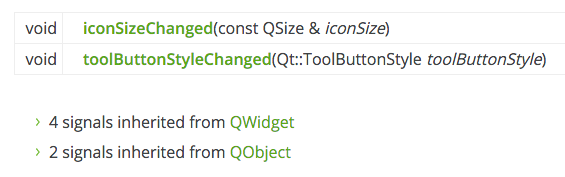

# Basic Qt Features

Welcome to your first steps in create graphical applications! In this chapter you will
be introduced to the key basic features of Qt (PyQt) that you will find yourself using
in any applications you create. We will develop a series of small applications,
adding (and removing!) features step-by-step. Use the code given as your guide, and 
feel free to experiment around it — particularly with reference to the [Qt Documentation](http://doc.qt.io/qt-5/).

## My first Window

So, lets get started by creating our very first windowed application. Before getting
the window on the screen, there are a few key concepts to introduce about how
applications are organised in the Qt world. If you're already familiar with event
loops you can safely skip to the next section.

### The Event loop and `QApplication`

The core of every Qt Applications is the `QApplication` class. Every application
needs one — and only one — `QApplication` object to function. This object holds
the *event loop* of your application — the core loop which governs all user 
interaction with the GUI.

Each interaction with your application — whether a press of a key, click of a mouse,
or mouse movement — generates an *event* which is placed on the *event queue*.
In the event loop, the queue is checked on each iteration and if a waiting event
is found, the event and control is passed to the specific *event handler* for the event. 
The event handler deals with the event, then passes control back to the event
loop to wait for more events. There is only *one* running event loop per 
application.



- QApplication holds the Qt event loop
- One QApplication instance required
- You application sits waiting in the event loop until an action is taken
- There is only *one* event loop



### Creating your App

So, lets create your first application! To start create a new Python file — you 
can call it whatever you like (e.g. `MyApp.py`).

W> ### Backup!
W>
W> We'll be editing within this file as we go along, and you may want to come
W> back to earlier versions of your code, so remember to keep regular backups
W> along the way. For example, after each section save a file named `MyApp_<section>.py`

The source code for your very first application is shown below. Type it in verbatim,
and be careful not to make mistakes. If you do mess up, Python should let you know
what's wrong when you run it. If you don't feel like typing it all in, you can 
[download the source code](http://download.martinfitzpatrick.name/create-simple-gui-applications/all_the_source.zip).

<div style="page-break-after: always;"></div>

<<(code/creating_a_window_1.py)


Let's go through the code line by line. 

We start by importing the PyQt5 classes that we need for the application,
from the `QtWidgets`, `QtGui` and `QtCore` submodules.

I> This kind of global import `from <module> import *` is generally
I> frowned upon in Python. However, in this case we know that the 
I> PyQt classnames don't conflict with one another, or with Python itself.
I> Importing them all saves a lot of typing, and helps with PyQt4 compatibility.

Next we create an instance of `QApplication`, passing in `sys.arg` (which contains 
command line arguments). This allows us to pass command line arguments to our
application. If you know you won't be accepting command line arguments you can
pass in an empty list instead, e.g.

````python
app = QApplication([])
````

Finally, we call `app.exec_()` to start up the event loop.

I> The underscore is there because `exec` is a reserved word in Python and can’t
I> be used as a function name. PyQt5 handles this by appending an underscore to the 
I> name used in the C++ library. You'll also see it for `.print_()`.

So, lets launch your application. You can run it from the command line like any
other Python script, for example:

    python MyApp.py
    
Or, for Python 3:

    python3 MyApp.py

The application should run without errors, yet there will be no indication of 
anything happening, aside from perhaps a busy indicator. This is completely 
normal — we haven't told Qt to create a window yet!

Every application needs at least one `QMainWindow`, though you can have more
than one if you ned to. However, no matter how many you have, your application
will always exit when the last main window is closed.

Let's add a `QMainWindow` to our application.

<<(code/creating_a_window_2.py)

<div style="page-break-after: always;"></div>

I> #### `QMainWindow`
I>
I> - Main focus for user of your application
I> - Every application needs at least one (...but can have more)
I> - Application will exit when last main window is closed

If you launch the application you should now
see your main window. Notice that Qt automatically creates a window with the normal
window decorations, and you can drag it around and resize it like any normal window.

E> #### I can't see my window!
E> 
E> You must *always* call  `.show()` on a newly created `QMainWindow` as they
E> are created invisible by default.

Congratulations — you've created your first Qt application! It's not very
interesting at the moment, so lets add some content to the window.

If you want to create a custom window, the best approach is to subclass 
`QMainWindow` and then include the setup for the window in the `__init__`
block. This allows the window behaviour to be self contained. So 
lets add our own subclass of `QMainWindow` — we can call it `MainWindow` to
keep things simple.

<div style="page-break-after: always;"></div>

<<(code/creating_a_window_end.py)

Notice how we write the `__init__` block with a small bit of boilerplate to take
the arguments (none currently) and pass them up to the `__init__` of
the parent `QMainWindow` class.

I> When you subclass a Qt class you must *always* call the super
I> `__init__` function to allow Qt to set up the object.

Next we use `.setWindowTitle()` to change the title of our main window.

Then we add our first widget — a `QLabel` — to the middle of the window.
This is one of the simplest widgets available in Qt. You create the object
by passing in the text that you want the widget to display.

We set the alignment of the widget to the center, so it will show up inin
the middle of the window.


The Qt namespace (`Qt.`) is full of all sorts of attributes that you can use
to customise and control Qt widgets. We’ll cover that a bit more later,
[it’s worth a look](http://doc.qt.io/qt-5/qt.html).


Finally, we call `.setCentralWidget()` on the the window. This is a
`QMainWindow` specific function that allows you to set the widget that
goes in the middle of the window.

If you launch your application you should see your window again, but this time
with the `QLabel` widget in the middle. 


#### Hungry for widgets?
We'll cover more widgets in detail shortly
but if you're impatient and would like to jump ahead you can take a look at the
[QWidget documentation](http://doc.qt.io/qt-5/widget-classes.html#basic-widget-classes). Try adding the different widgets to your window!


In this section we've covered the `QApplication` class, the `QMainWindow`
class, the event loop and experimented with adding a simple widget to a window. In the next
section we'll take a look at the mechanisms Qt provides for widgets and windows to 
communicate with one another and your own code.


Save a copy of your file as `MyApp_window.py` as we'll need it again later.


## Signals, Slots, Events

As already described, every interaction the user has with a Qt application causes
an Event. There are multiple types of event, each representing a difference
type of interaction — e.g. mouse or keyboard events.

Events that occur are passed to the event-specific handler on the widget where
the interaction occurred. For example, clicking on a widget will cause a
`QMouseEvent` to be sent to the `.mousePressEvent` event handler on the widget.
This handler can interrogate the event to find out information, such as 
what triggered the event and where specifically it occurred.

You can intercept events by subclassing and overriding the handler function on
the class, as you would for any other function. You can choose to filter,
modify, or ignore events, passing them through to the normal handler for 
the event by calling the parent class function with `super()`.

    class CustomButton(Qbutton)

        def keyPressEvent(self, e):
            # My custom event handling
            super(CustomButton, self).keyPressEvent(e)

However, imagine you want to catch an event on 20 different buttons. Subclassing
like this now becomes an incredibly tedious way of catching, interpreting
and handling these events.
    
    class CustomButton99(Qbutton)

        def keyPressEvent(self, e):
            # My custom event handling
            super(CustomButton99, self).keyPressEvent(e)

Thankfully Qt offers a neater approach to receiving notification of 
things happening in your application: *Signals*.


### Signals

Instead of intercepting raw events, signals allow you to 'listen' for
notifications of specific occurrences within your application. While
these can be similar to events — a click on a button — they can also
be more nuanced — updated text in a box. Data can also be sent 
alongside a signal - so as well as being notified of the updated text 
you can also receive it.

The receivers of signals are called *Slots* in Qt terminology. A number of
standard slots are provided on Qt classes to allow you to wire together
different parts of your application. However, you can also use any Python
function as a slot, and therefore receive the message yourself.


Load up a fresh copy of `MyApp_window.py` and save it under a new name for this section.


#### Basic signals

First, let's look at the signals available for our `QMainWindow`. You can
find this information in the [Qt documentation](http://doc.qt.io/qt-5/qmainwindow.html).
Scroll down to the Signals section to see the signals implemented for 
this class. 



As you can see, alongside the two `QMainWindow` signals, there are 
4 signals inherited from `QWidget` and 2 signals inherited from `Object`.
If you click through to the `QWidget` signal documentation you can see a
`.windowTitleChanged` signal implemented here. Next we'll demonstrate that
signal within our application. 


<div style="page-break-after: always;"></div>

<<(code/signals_slots_and_events_1.py)

<div style="page-break-after: always;"></div>

We start by creating an function that will behave as a ‘slot’ for our
signals.

Then we use .connect on the `.windowTitleChanged` signal. We pass the
function that we want to be called with the signal data. In this case
the signal sends a string, containing the new window title.

If we run that, we see that we receive the notification that the window
title has changed.

#### Customising signal data

As you find yourself using signals more often, you'll often find that
you want to be able to customise the data that is sent with them.
Unfortunately there is no way to do this in Qt directly, but we can 
exploit some features of Python to make it work for us.

To start with, lets see how to send less data. For example we’ll create
a function that accepts two parameters, with default values. However,
neither of these is a string. How can we connect our
`.windowTitleChanged` signal to this function?

We can do this by using a wrapper function, or a lambda. When the signal is
emitted this wrapper function will be called and can add or remove data
from the signal as required, before passing it on to the real slot.

So, for example, to discard data from a signal that emits a single value
we could use the following construction. 

    def wrapper_function(x):
        real_function()  # To call target, discarding x

Here the `wrapper_function` accepts the `x` value, but does not pass it when
calling `real_function`. We can also write this using a lambda as follows:

    lamba x: fn()

Just like the function, the lambda accepts a single parameter `x`, then discards it
calling the *real* target `fn` with no parameters:

T> It doesn't matter whether you use a normal function or `lambda`
T> (one-line function) for these. However, we use the lambda syntax here
T> because it makes for clearer code. For example, the following are
T> functionally identifical.

If we want to send *more* data we can use a similar construction, but 
instead of discarding a parameter we add another. For example:

    def wrapper_function(x)
        real_function(x, some_more_data)
        
Or again, with `lambda` syntax:

    lamba x: fn(x, some_more_data)

However, lets try that again with a loop. Here we’re going to use a
layout to create a list of widgets, don’t worry about that it’ll be
explained later.

You’ll notice that clicking on all of the widgets gives the same result?

So, what can we do? If we pass the extra data in as a named parameter to
the lambda, we create a new namespace and voila it works.

    lambda x, data=data: fn(x, data)



#### You *must* use named parameters

Because of the way variables are bound in Python, if you just use the 
variable inside the lambda/function it will remain bound to the loop.
When any signal is triggered, that variable will equal the last value
it had in the loop.
However, when passing in as a named variable the value is bound directly
each time the function/lambda is defined, and each signal gets a different
value.


So, now you should be able to pass just about anything to any function
using signals! The final code now looks like this:

<div style="page-break-after: always;"></div>

<<(code/signals_slots_and_events_2.py)

<div style="page-break-after: always;"></div>

#### Custom Signals

The final bit of signals we’re going to cover is custom signals. These
allow you to use the Qt event loop to send data around your application.
It’s a great way to keep your app modular and responsive.

Signals must be defined on the class. You pass in the type that will be
sent with the signal when creating it. You can send any Python type,
including multiple types, and compound types (e.g. dictionaries, lists).

Then, you can connect and use your signal just as normal.


### Events

Next, let’s take a quick look at events. Thanks to signals, for most
purposes you can happily avoid using events in Qt, but it’s important
to understand how they work for when they are neccessary.

As an example, we're going to intercept the `.contextMenuEvent` on 
`QMainWindow`. This event is fired whenever a context menu is 
*about to be* shown, and is passed a single value `event` of type
`QContextMenuEvent`.

To intercept the event, we simply override the object method with our
new method of the same name. So in this case we can create a method
on our `MainWindow` subclass with the name `contextMenuEvent` and it
will receive all events of this type.

    def contextMenuEvent(self, event):
        print("Context menu event!")

If you add the above method to your `MainWindow` class and run your 
program you will discover that right-clicking in your window now
displays the message in the print statement.

Sometimes you may wish to intercept an event, yet still trigger 
the default (parent) event handler. You can do this by calling the
event handler on the parent class using `super` as normal for
Python class methods.

    def contextMenuEvent(self, event):
        print("Context menu event!")
        super(self, MainWindow).contextMenuEvent(event)

This allows you to propogate events up the object hierarchy, handling only
those parts of an event handler that you wish to.


However, in Qt there is another type of event hierarchy, constructed 
around the UI relationships. Widgets that are added to a layout, within 
another widget, may opt to pass their events to their UI parent. 
In complex widgets with multiple sub-elements this can allow for 
delegation of event handling to the containing widget for certain events.

However, if you have dealt with an event and do not want it
to propogate in this way you can flag this by calling .accept() on the event.

    class CustomButton(Qbutton)
    
        def event(self, e):
            e.accept()

Alternatively, if you do want it to propogate calling .ignore() will
achieve this.

    class CustomButton(Qbutton)
    
        def event(self, e):
            e.ignore()

In this section we've covered signals, slots and events. We've demonstrated
some simple signals, including how to pass less and more data using lambdas.
We've created custom signals, and shown how to intercept events, pass on
event handling and use `.accept()` and `.ignore()` to hide/show events
to the UI-parent widget. In the next section we will go on to take 
a look at two common features of the GUI — toolbars and menus.

<div style="page-break-after: always;"></div>

## Actions, Toolbars and Menus

Next we'll look at some of the common user interface elements, that you've probably seen
in many other applications — toolbars and menus. We'll also explore the neat system 
Qt provides for minimising the duplication between different UI areas — `QAction`.

### Toolbars

One of the most commonly seen user interface elements is the toolbar.Toolbars are bars of icons and/or text used to perform common tasks within an
application, for which accessing via a menu would be cumbersome.
They are one of the most common UI features seen in many applications. While 
some complex applications, particularly in the Microsoft Office suite, have 
migrated to contextual 'ribbon' interfaces, the standard toolbar is usually 
sufficient for the majority of applications you will create.


Qt toolbars support display of icons, text, and can also contain any standard
Qt widget. However, for buttons the best approach is to make use of the 
QAction system to place buttons on the toolbar.

Let's start by adding a toolbar to our application.

{icon=floppy-o}
G> Load up a fresh copy of `MyApp_window.py` and save it under a new name for this section.

In Qt toolbars are created from the QToolBar class. To start you create an instance of the class
and then call `.addToolbar` on the QMainWindow. Passing a string in as the first
parameter to `QToolBar` sets the toolbar's name, which will be used to identify the toolbar 
in the UI.

<<(code/toolbars_and_menus_1.py)


** Run it!** You'll see a thin grey bar at the top of the window. This is your toolbar. Right click
and click the name to toggle it off.




**I can't get my toolbar back!?** Unfortunately once you remove a toolbar there is now no place to right click to re-add
it. So as a general rule you want to either keep one toolbar unremoveable, or provide
an alternative interface to turn toolbars on and off.


Lets make the toolbar a bit more interesting. We could just add a `QButton` widget, but there
is a better approach in Qt that gets you some cool features — and that is via `QAction`.
`QAction` is a class that provides a way to describe abstract user interfaces. What this means
in English, is that you can define multiple interface elements within a single object, unified
by the effect that interacting with that element has. For example, it is common to have functions
that are represented in the toolbar but also the menu — think of something like Edit->Cut
which is present both in the Edit menu but also on the toolbar as a pair of scissors, and 
also through the keyboard shortcut `Ctrl-X` (`Cmd-X` on Mac). 

Without `QAction` you would have to define this in multiple places. But with `QAction` you can 
define a single `QAction`, defining the triggered action, and then add this action to both the 
menu and the toolbar. Each `QAction` has names, status messages, icons and signals that you \
can connect to (and much more).

So lets add our first `QAction`.

<<(code/toolbars_and_menus_2.py)


To start with we create the function that will accept the signal from teh QAction so we can
see if it is working.  Next we define the `QAction` itself. When creating the instance we can 
pass a label for the action and/or an icon. You must also pass in any `QObject` to act as the 
parent for the action — here we're passing `self` as a reference to our main window.
Strangely for QAction the parent element is passed in as the final parameter.


Next, we can opt to set a status tip — this text will be displayed on the status bar 
once we have one. Finally we connect the `.triggered` signal to the custom function. This 
signal will fire whenever the `QAction` is 'triggered' (or activated).



#### Run it!
You should see your button with the label that you have defined. Click on it and the 
our custom function will emit "click" and the status of the button.




#### Why is the signal always false?
The signal passed indicates whether the button is *checked*,
and since our button is not checkable — just clickable — it is always false.
We'll show how to make it checkable shortly.


Lets add a statusbar.

We create a status bar object by calling `QStatusBar` and passing the result into `.setStatusBar`. Since we
don't need to change the statusBar settings we can just pass it in as we create it. We can
create and define the statusbar in a single line:

<<(code/toolbars_and_menus_3.py)


#### Run it!
Hover your mouse over the toolbar button and you will see the status text in the status bar.


Next we're going to turn our QAction toggleable — so clicking will turn it on, clicking again
will turn it off. To do this, we simple call `setCheckable(True)` on the `QAction` object.

<<(code/toolbars_and_menus_4.py)


#### **Run it!** Click on the button to see it toggle from checked to unchecked state. Note that custom slot
function we create now alternates outputting `True` and `False`.



#### `.toggled`
There is also a `.toggled` signal, which only emits a signal when the button 
is toggled. But the effect is identical so it is mostly pointless.


Things look pretty shabby right now — so let's add an icon to our button. For this I recommend
you download the [fugue icon set](http://p.yusukekamiyamane.com/) by designer Yusuke Kamiyamane. 
It's a great set of beautiful 16x16 icons that can give your apps a nice professional look.
It is freely available with only attribution required when you distribute your application — 
although I am sure the designer would appreciate some cash too if you have some spare.


Select an image from the set (in the examples here I've selected the file `bug.png`) and copy
it into the same folder as your source code. To add the icon to the `QAction` (and therefore
the button) we simply pass it in as the first parameter when creating the `QAction`. If
the icon is in the same folder as your source code you can just copy it to 

You also need to let the toolbar know how large your icons are, otherwise your icon will
be surrounded by a lot of padding. You can do this by calling `.setIconSize()` with a `QSize` object.

<<(code/toolbars_and_menus_4.py)


#### Run it!

The QAction is now represented by an icon. Everything should function exactly as it did before.


Note that Qt uses your operating system
default settings to determine whether to show an icon, text or an icon and text in the toolbar.
But you can override this by using `.setToolButtonStyle`. This slot accepts any of the 
following flags from the `Qt.` namespace:


| Flag                          | Behaviour                                 |
|-------------------------------|-------------------------------------------|
| `Qt.ToolButtonIconOnly`       | Icon only, no text                        |
| `Qt.ToolButtonTextOnly`       | Text only, no icon                        |
| `Qt.ToolButtonTextBesideIcon` | Icon and text, with text beside the icon  |
| `Qt.ToolButtonTextUnderIcon`  | Icon and text, with text under the icon   |
| `Qt.ToolButtonIconOnly`       | Icon only, no text                        |
| `Qt.ToolButtonFollowStyle`    | Follow the host desktop style             |


T> #### Which style should I use?
T>
T> The default value is `Qt.ToolButtonFollowStyle`, meaning that your application
T> will default to following the standard/global setting for the desktop on
T> which the application runs. This is generally recommended to make your 
T> application feel as *native* as possible. 

Finally, lets just add a few more bits and bobs to the toolbar. We'll add a second button
and a checkbox widget. As mentioned you can literally put any widget in here, so 
feel free to go crazy. Don't worry about the QCheckBox type, we'll cover that later.

<<(code/toolbars_and_menus_6.py)

{icon=rocket}
G> #### Run it!
G>
G> Now you see multiple buttons and a checkbox.


### Menus

Menus are another standard component of UIS. Typically they are on the top of the window,
or the top of a screen on a Mac. They allow access to all standard application functions.
A few standard menus exist — for example File, Edit, Help.
Menus can be nested to create hierarchical trees of functions and they often support and
display keyboard shortcuts for fast access to their functions. 


To create a menu, we create a menubar we call `.menuBar()` on the QMainWindow.
We add a menu on our menu bar by calling `.addMenu()`, passing in the name of the menu. 
I've called it `'&File'`.  The amspersand defines a quick key to jump to this menu when pressing Alt. 

<<(code/toolbars_and_menus_7.py)

B> Quick Keys on Mac
B> 
B> This won't be visible on Mac. Note that this is different to a keyboard shortcut — we'll 
B> cover that shortly.

Next we add something to menu. This is where the power of QActions comes in to play. We can
reuse the already existing QAction to add the same function to the menu. Click it and you will
notice that it is toggleable — it inherits the features of the QAction.

Lets add some more things to the menu. Here we'll add a separator to the menu, which will
appear as a horizontal line in the menu, and then add the second QAction we created.

<<(code/toolbars_and_menus_8.py)

{icon=rocket}
G> #### Run it!
G>
G> You should see two menu items with a line between them.

You can also use ampersand to add accelerator keys to the menu to allow a single key to be used to jump to a
menu item when it is open.  Again this doesn't work on Mac.

To add a submenu, you simply create a new menu by calling `addMenu()` on the parent menu.
You can then add actions to it as normal. For example:

<<(code/toolbars_and_menus_9.py)

Finally lets add a keyboard shortcut to the `QAction`. 
You define a keyboard shortcut by passing setKeySequence() and passing in the key sequence.
Any defined key sequences will appear in the menu.

T> Hidden shortcuts
T>
T> Note that the keyboard shortcut is associated
T> with the `QAction` and will still work whether or not the `QAction` is added to a menu or a toolbar.

Key sequences can be defined in multiple ways - either by passing as text, using key names from the 
Qt namespace, or using the defined keysequences from the Qt namespace. Use the latter wherever you can
to ensure compliance with the operating system standards.

The completed code, showing the toolbar buttons and menus is shown below.

<<(code/toolbars_and_menus_10.py)


{icon=floppy-o}
G> Save a copy of your file as `MyApp_menus.py` as we'll need it again later.

<div style="page-break-after: always;"></div>

## Widgets

In Qt (and most User Interfaces) ‘widget’ is the name given to a
component of the UI that the user can interact with. User interfaces are
made up of multiple widgets, arranged within the window.

Qt comes with a large selection of widgets available, and even allows
you to create your own custom and customised widgets.

{icon=floppy-o}
G> Load up a fresh copy of `MyApp_window.py` and save it under a new name for this section.

### Big ol' list of widgets

A full list of widgets is available on the Qt documentation. But lets
have a look at them quickly.

<div style="page-break-after: always;"></div>

<<(code/widgets_list.py)

<div style="page-break-after: always;"></div>

To do this we’re going to take the skeleton of our application and
replace the `QLabel` with a `QWidget`. This is the generic form of a Qt
widget.

Here we’re not using it directly. We apply a list of widgets - in a
layout, which we will cover shortly - and then add the `QWidget` as the
central widget for the window. The result is that we fill the window
with widgets, with the `QWidget` acting as a container.

T> ### Compound widgets
T>
T> Note that it’s possible to use this `QWidget` layout trick to create
T> custom compound widgets. For example you can take a base `QWidget` and
T> overlay a layout containing multiple widgets of different types. This
T> 'widget' can then be inserted into other layouts as normal. We'll
T> cover custom widgets in more detail later.

Lets have a look at all the example widgets, from top to bottom:

| Widget            | What it does                              |
|-------------------|-------------------------------------------|
| `QCheckbox`       | A checkbox                                | 
| `QComboBox`       | A dropdown list box                       |
| `QDateEdit`       | For editing dates and datetimes           |
| `QDateTimeEdit`   | For editing dates and datetimes           |
| `QDial`           | Rotateable dial                           |
| `QDoubleSpinbox`  | A number spinner for floats               |
| `QFontComboBox`   | A list of fonts                           |
| `QLCDNumber`      | A quite ugly LCD display                  |
| `QLabel`          | Just a label, not interactive             |
| `QLineEdit`       | Enter a line of text                      |
| `QProgressBar`    | A progress bar                            |
| `QPushButton`     | A button                                  |
| `QRadioButton`    | A toggle set, with only one active item   |
| `QSlider`         | A slider                                  |
| `QSpinBox`        | An integer spinner                        |
| `QTimeEdit`       | For editing times                         |

There are actually more widgets than this, but they don’t fit so well!
You can see them all by checking the documentation. Here we’re going to
take a closer look at the a subset of the most useful.

<div style="page-break-after: always;"></div>

#### QLabel

We'll start the tour with `QLabel`, arguably one of the simplest widgets
available in the Qt toolbox. This is a simple one-line piece of text
that you can position in your application. You can set the text by 
passing in a str as you create it:

    widget = QLabel("Hello")

Or, by using the `.setText()` method:

    widget = QLabel("1") # The label is created with the text 1
    widget.setText("2")  # The label now shows 2
    
You can also adjust font parameters, such as the size of the font or
the alignment of text in the widget.

<<(code/widgets_1.py)

I> ## Font tips
I> 
I> Note that if you want to change the properties of a widget font it
I> is usually better to get the *current* font, update it and then 
I> apply it back. This ensures the font face remains in keeping with 
I> the desktop conventions.

The alignment is specified by using a flag from the `Qt.` namespace.
The flags available for horizontal alignment are:


| Flag              | Behaviour                                     |
|-------------------|-----------------------------------------------|
| `Qt.AlignLeft`    | Aligns with the left edge.                    |
| `Qt.AlignRight`   | Aligns with the right edge.                   |
| `Qt.AlignHCenter` | Centers horizontally in the available space.  |
| `Qt.AlignJustify` | Justifies the text in the available space.    |

The flags available for vertical alignment are:

| Flag              | Behaviour                                     | 
|-------------------|-----------------------------------------------|
| `Qt.AlignTop`     | Aligns with the top.                          |
| `Qt.AlignBottom`  | Aligns with the bottom.                       |
| `Qt.AlignVCenter` | Centers vertically in the available space.    |


You can combine flags together using pipes (`|`), however note that you
can only use vertical or horizontal alignment flag at a time.

```python
align_top_left = Qt.AlignLeft | Qt.AlignTop
```

I> Qt Flags
I>
I> Note that you use an *OR* pipe (`|`) to combine the two flags (not `A & B`).
I> This is because the flags are non-overlapping bitmasks.
I> e.g. `Qt.AlignLeft` has the hexadecimal value `0x0001`, 
I> while `Qt.AlignBottom` is `0x0040`.
I> By ORing together we get the value `0x0041` representing 'bottom left'.
I> This principle applies to all other combinatorial Qt flags.
I>
I> If this is gibberish to you, feel free to ignore and move on.


Finally, there is also a shorthand flag that centers in both directions simultaneously:

| Flag              | Behaviour                                       |
|-------------------|-------------------------------------------------|
| `Qt.AlignCenter`  | Centers horizontally *and* vertically           |


Weirdly, you can also use `QLabel` to display an image using `.setPixmap()`. 
This accepts an *pixmap*, which you can create by passing an image filename
to `QPixmap`. In the example files provided with this book you can find
a file `hrh.jpg` which you can display in your window as follows:

```python
widget.setPixMap(QPixmap('hrh.jpg'))
```    

<div style="page-break-after: always;"></div>


God Save the Queen. By default the image scales while maintaining its
aspect ratio. If you want it to stretch and scale to fit the window completely
you can set `.setScaledContents(True)` on the `QLabel`.

```python
widget.setScaledContents(True)
```

<div style="page-break-after: always;"></div>

#### QCheckBox

The next widget to look at is `QCheckBox()` which, as the name suggests, presents a
checkable box to the user. However, as with all Qt widgets there are number of
configurable options to change the widget behaviours.

<<(code/widgets_3.py)

You can set a checkbox state programmatically using `.setChecked` or `.setCheckState`.
The former accepts either `True` or `False` representing checked or unchecked respectively.
However, with `.setCheckState` you also specify a particially checked state using a
`Qt.` namespace flag:

| Flag                  | Behaviour                                       |
|-----------------------|-------------------------------------------------|
| `Qt.Unchecked`        | Item is unchecked                               |
| `Qt.PartiallyChecked` | Item is partially checked                       |
| `Qt.Checked`          | Item is unchecked                               |

A checkbox that supports a partially-checked (`Qt.PartiallyChecked`) state is
commonly referred to as 'tri-state', that is being neither on nor off. A checkbox
in this state is commonly shown as a greyed out checkbox, and is commonly used in
hierachical checkbox arrangements where sub-items are linked to parent checkboxes.

If you set the value to `Qt.PartiallyChecked` the checkbox will become
tristate. You can also `.setTriState(True)` to set tristate support on a
You can also set a checkbox to be tri-state without setting the current state to
partially checked by using `.setTriState(True)` 

T> You may notice that when the script is running the current state number is displayed 
T> as an `int` with checked = `2`, unchecked = `0`, and partially 
T> checked = `1`. You don’t need to remember these values, the `Qt.Checked` namespace
T> variable `== 2` for example. This is the value of these state's respective flags.
T> This means you can test state using `state == Qt.Checked`.

<div style="page-break-after: always;"></div>

#### QComboBox

The `QComboBox` is a drop down list, closed by default with an arrow to open it.
You can select a single item from the list, with the currently selected item being
shown as a label on the widget. The combo box is suited to selection of a choice
from a long list of options. 

I> You have probably seen the combo box used for selection of 
I> font faces, or size, in word processing applications. Although Qt actually provides
I> a specific font-selection combo box as `QFontComboBox`. 

You can add items to a `QComboBox` by passing a list of strings to `.addItems()`. 
Items will be added in the order they are provided. 

<<(code/widgets_4.py)

The `.currentIndexChanged` signal is triggered when the currently selected item
is updated, by default passing the index of the selected item in the list.
However, when connecting to the signal you can also request an alternative version
of the signal by appending `[str]` (think of the signal as a `dict`). This alternative
interface instead provides the label of the currently selected item, which is often
more useful.

`QComboBox` can also be editable, allowing users to enter values not currently in the list
and either have them inserted, or simply used as a value. To make the box editable:

```python
widget.setEditable(True)
```

You can also set a flag to determine how the insert is handled. These flags are stored
on the `QComboBox` class itself and are listed below:


| Flag                              | Behaviour                                  |
|-----------------------------------|--------------------------------------------|
| `QComboBox.NoInsert`              | No insert                                  |
| `QComboBox.InsertAtTop`           | Insert as first item                       |
| `QComboBox.InsertAtCurrent`       | Replace currently selected item            |
| `QComboBox.InsertAtBottom`        | Insert after last item                     |
| `QComboBox.InsertAfterCurrent`    | Insert after current item                  |
| `QComboBox.InsertBeforeCurrent`   | Insert before current item                 |
| `QComboBox.InsertAlphabetically`  | Insert in alphabetical order               |

To use these, apply the flag as follows:

```python
widget.setInsertPolicy(QComboBox.InsertAlphabetically)
```

You can also limit the number of items allowed in the box by using `.setMaxCount`, e.g.

```python
widget.setMaxCount(10)
```

<div style="page-break-after: always;"></div>

#### QListBox

Next `QListBox`. It’s very similar to `QComboBox`, differing mainly in the
signals available.

<<(code/widgets_5.py)

`QListBox` offers an `currentItemChanged` signal which sends the `QListItem`
(the element of the list box), and a `currentTextChanged` signal which
sends the text.

<div style="page-break-after: always;"></div>

#### QLineEdit

The `QLineEdit` widget is a simple single-line text editing box, into
which users can type input. These are used for form fields, or settings
where there is no restricted list of valid inputs. For example, when
entering an email address, or computer name.

<<(code/widgets_6.py)

As demonstrated in the above code, you can set a maximum length for the 
text field by using `.setMaxLength`. Placeholder text, which is text shown 
until something is entered by the user can be added using `.setPlaceholderText`.

The `QLineEdit` has a number of signals available for different editing 
events including when return is pressed (by the user), when the user selection
is changed. There are also two edit signals, one for when the text in the box 
has been edited and one for when it has been changed. The distinction here is 
between user edits and programmatic changes. The `textEdited` signal is only 
sent when the user edits text.

Additionally, it is possible to perform input validation using an *input mask*
to define which characters are supported and where. This can be applied
to the field as follows:

```python
widget.setInputMask('000.000.000.000;_')
```

The above would allow a series of 3-digit numbers separated with periods, and
could therefore be used to validate IPv4 addresses.

<div style="page-break-after: always;"></div>

#### QSpinBox and QDoubleSpinBox

`QSpinBox` provides a small numerical input box with arrows to increase
and decrease the value. `QSpinBox` supports integers while the related widget
`QDoubleSpinBox` supports floats.

<<(code/widgets_7.py)

The demonstration code above shows the various features that are available 
for the widget.

To set the range of acceptable values you can use `setMinimum` and `setMaximum`,
or alternatively use `setRange` to set both simultaneously. Annotation of value
types is supported with both prefixes and suffixes that can be added to the number,
e.g. for currency markers or units using `.setPrefix` and `.setSuffix` respectively.

Clicking on the up and down arrows on the widget will increase or decrease the 
value in the widget by an amount, which can be set using `.setSingleStep`. Note
that this has no effect on the values that are acceptable to the widget.

Both `QSpinBox` and `QDoubleSpinBox` have a `.valueChanged` signal which 
fires whenever their value is altered. The raw `.valueChanged` signal
sends the numeric value (either an `int` or a `float`) while the `str` 
alternate signal, accessible via `.valueChanged[str]` sends the value as a
string, including both the prefix and suffix characters.

<div style="page-break-after: always;"></div>

#### QSlider

`QSlider` provides a slide-bar widget, which functions internally much 
like a `QDoubleSpinBox`. Rather than display the current value numerically,
it is represented by the position of the slider
handle along the length of the widget. This is often useful when providing
adjustment between two extremes, but where absolutel accuracy is not required.
The most common use of this type of widget is for volume controls.

There is an additional `.sliderMoved` signal that is triggered whenever the
slider moves position and a `.sliderPressed` signal that emits whenever the
slider is clicked.

<<(code/widgets_8.py)

You can also construct a slider with a vertical or horizontal orientation by 
passing the orientation in as you create it. The orientiation flags are
defined in the `Qt.` namespace. For example: 

```python
widget.QSlider(Qt.Vertical)
```
    
Or:

```python    
widget.QSlider(Qt.Horizontal)
```

<div style="page-break-after: always;"></div>

#### QDial

Finally, the `QDial` is a rotateable widget that functions just like the
slider, but appears as an analogue dial. This looks nice, but from a UI
perspective is not particularly userfriendly. However, they are often
used in audio applications as representation of real-world analogue dials.

<<(code/widgets_9.py)

The signals are the same as for `QSlider` and retain the same names
(e.g. `.sliderMoved`).

This concludes our brief tour through the Qt widgets available in
PyQt. To see the full list of available widgets, including all their signals and
attributes, take a look at the [Qt documentation](http://doc.qt.io/qt-5/).


## Layouts

So far we've successfully created a window, and we've added a widget to it. However
we normally want to add more than one widget to a window, and have some control over 
where it ends up. To do this in Qt we use *layouts*. There are 4 basic layouts 
available in Qt, which are listed in the following table. 

| Layout                            | Behaviour                               |
|-----------------------------------|-----------------------------------------|
| `QHBoxLayout`                     | Linear horizontal layout                |
| `QVBoxLayout`                     | Linear vertical layout                  |
| `QGridLayout`                     | In indexable grid XxY                   |
| `QStackedLayout`                  | Stacked (z) in front of one another     |


T> #### Qt Designer
T> 
T> You can actually design and lay out your interface graphically using the Qt
T> designer, which we will cover later. Here we're using code, as it's simpler
T> to understand and experiment with the underlying system.

As you can see, there are three positional layouts available in Qt. The `VBoxLayout`,
`QHBoxLayout` and `QGridLayout`. In addition there is also `QStackedLayout` which 
allows you to place widgets one on top of the other within the same space, yet
showing only one layout at a time.

{icon=floppy-o}
G> Load up a fresh copy of `MyApp_window.py` and save it under a new name for this section.

Before we start experimenting with the different layouts, we're first going to 
create a very simple custom widget that we can use to visualise the layouts 
that we use. Add the following code to your file as a new class at the top level:

<<(code/layout_colorwidget.py)

In this code we subclass `QWdiget` to create our own custom widget `Color`. We accept a
single parameter when creating the widget — `color` (a `str`). We first set
`.setAutoFillBackground` to `True` to tell the widget to automatically fill it's background
with the window color. Next we get the current palette (which is the global desktop palette
by default) and change the current `QPalette.Window` color to a new `QColor` described
by the value `color` we passed in. Finally we apply this palette back to the widget. The
end result is a widget that is filled with a solid color, that we specified when we
created it.

If you find the above confusing, don't worry too much. We'll cover custom widgets in 
more detail later. For now it's sufficient that you understand that calling you
can create a solid-filled red widget by doing the following:

```python
Color('red')
```
    
First let's test our new `Color` widget by using it to fill the entire window in a 
single color. Once it’s complete we can add it to the mainwindow using `.setCentralWidget`
and we get a solid red window.

<<(code/layout_1.py)

{icon=rocket}
G> #### Run it!
G>
G> The window will appear, filled completely with the color red.
G> Notice how the widget expands to fill all the available space.

Next we'll look at each of the available Qt layouts in turn. Note
that to add our layouts to the window we will need a dummy
`QWidget` to hold the layout.

### `QVBoxLayout` vertically arranged widgets

With `QVBoxLayout` you arrange widgets one above the other linearly.
Adding a widget adds it to the bottom of the column.


Lets add our widget to a layout. Note that in order to add a layout to the 
`QMainWindow` we need to apply it to a dummy `QWidget`. This allows us to then
use `.setCentralWidget` to apply the widget (and the layout) to the window.
Our coloured widgets will arrange themselves in the layout,
contained within the `QWidget` in the window. First we just add the red widget 
as before.

<<(code/layout_2a.py)

{icon=rocket}
G> #### Run it!
G>
G> Notice the border now visible around the red widget. This is the layout
G> spacing — we'll see how to adjust that later.

Next add a few more coloured widgets to the layout:

As we add widgets they line themselves up vertically in the order they
are added.

### `QHBoxLayout` horizontally arranged widgets

`QHBoxLayout` is the same, except moving horizontally. Adding a widget
adds it to the right hand side.


To use it we can simply change the `QVBoxLayout` to a `QHBoxLayout`.
The boxes now flow left to right.

<<(code/layout_3.py)


### Nesting layouts

For more complex layouts you can nest layouts inside one another using 
.addLayout` on a layout. Below we add a `QVBoxLayout` into the main `QHBoxLayout`.
If we add some widgets to the `QVBoxLayout`, they’ll be arranged vertically in the first slot of the
parent layout.

<<(code/layout_4.py)

{icon=rocket}
G> #### Run it!
G>
G> The widgets should arrange themselves in 3 columns horizontally, with the 
G> first column also containing 3 widgets stacked vertically. Experiment!

You can set the spacing around the layout using `.setContentMargins`
or set the spacing between elements using `.setSpacing`.

```python
layout1.setContentsMargins(0,0,0,0)
layout1.setSpacing(20)
```
    
The following code shows the combination of nested widgets and layout margins
and spacing. Experiment with the numbers til you get a feel for them.
    
<<(code/layout_5.py)

### `QGridLayout` widgets arranged in a grid

As useful as they are, if you try and using `QVBoxLayout` and `QHBoxLayout` for
laying out multiple elements, e.g. for a form, you’ll find it very
difficult to ensure differently sized widgets line up. The solution to
this is `QGridLayout`.


`QGridLayout` allows you to position items specifically in a grid. You
specify row and column positions for each widget. You can skip elements,
and they will be left empty.

Usefully, for `QGridLayout` you don't need to fill all the positions in the grid.


<<(code/layout_6.py)


### `QStackedLayout` multiple widgets in the same space


The final layout we’ll cover is the `QStackedLayout`. As described, this
layout allows you to position elements directly in front of one another.
You can then select which widget you want to show.
You could use this for drawing layers in a graphics application,
or for imitating a tab-like interface. Note there is also `QStackedWidget`
which is a container widget that works in exactly the same way. This is
useful if you want to add a stack directly to a `QMainWindow` with
`.setCentralWidget`.


<<(code/layout_7.py)

`QStackedWidget` is exactly how tabbed views in applications work. Only one view
('tab') is visible at any one time. You can control which widget to show at
any time by using `.setCurrentIndex()` or `.setCurrentWidget()` to set the item
by either the index (in order the widgets were added) or by the widget itself.

Below is a short demo using `QStackedLayout` in combination with `QButton` to 
to provide a tab-like interface to an application:

<<(code/layout_8.py)

Helpfully. Qt actually provide a built-in TabWidget that provides
this kind of layout out of the box - albeit in widget form.
Below the tab demo is recreated using `QTabWidget`:

<<(code/layout_9.py)

As you can see, it's a little more straightforward — and a bit more attractive!
You can set the position of the tabs using the cardinal directions, toggle
whether tabs are moveable with `.setMoveable` and turn a 'document mode' on 
and off which (on OS X) shows a slimmer tab interface.


## Dialogs

Dialogs are useful GUI components that allow you to *communicate* with the user (hence
the name dialog). They are commonly used for file Open/Save, settings, preferences, 
or for functions that do not fit into the main UI of the application. They are small 
modal (or *blocking*) windows that sit in front of the main application until they are 
dismissed.  Qt actually provides a number of 'special' dialogs for the most common
use-cases, allowing you to take advantage of desktop-specific tools for a better
user experience.

{icon=floppy-o}
G> Load up a fresh copy of `MyApp_menus.py` and save it under a new name for this section.


In Qt dialog boxes are handled by the `QDialog` class. To create a new dialog
box simply create a new object of `QDialog` type (or a subclass), passing in 
a parent widget, e.g. `QMainWindow`, as its parent.

{icon=floppy-o}
G> Load up a fresh copy of `MyApp_menus.py` and save it under a new name for this section.

Let's create our own `QDialog`, we'll use our menu example code so we can start a dialog
window when a button on the toolbar is pressed.

<<(code/dialogs_1.py)

In the triggered function (that receives the signal from the button )
we create the dialog instance, passing our `QMainWindow` instance as a
parent. This will make the dialog a *modal window* of `QMainWindow`. This means the
dialog will completely block interaction with the parent window.

Once we have created the dialog, we start it using `.exec_()` - just like we did for 
`QApplication` to create the main event loop of our application. That’s not a coincidence:
when you exec the `QDialog` an entirely new event loop - specific for the dialog - is created. 

I> #### One event loop to rule them all
I>
I> Remember I said there can only be one Qt event loop running at any time? 
I> I meant it! The `QDialog` completely blocks your application execution.
I> Don't start a dialog and expect anything else to happen anywhere else in your application.
I> 
I> We'll cover how you can use multithreading to get you out of this pickle in a later chapter.

{icon=rocket}
G> #### Run it!
G>
G> The window will display, now click the bug button and a modal
G> window should appear. You can exit by clicking the [x].

Like our very first window, this isn't very interesting. Let's fix that by 
adding a dialog title and a set of OK and Cancel buttons to allow the user to *accept* 
or *reject* the modal.

To customise the `QDialog` we can subclass it — again you *can* customise the dialog
without subclassing, but it's nicer if you do. 

<<(code/dialogs_2.py)

In the above code, we first create our subclass of `QDialog` which we've called `CustomDialog`.
As for the `QMainWindow` we customise it within the `__init__` block to ensure that our
customisations are created as the object is created. First we set a title for the `QDialog` using
`.setWindowTitle()`, exactly the same as we did for our main window.

The next block of code is concerned with creating and displaying the dialog buttons. This
is probably a bit more involved than you were expecting. However, this is due to Qt's flexibility
in handling dialog button positioning on different platforms.

I> #### Easy way out?
I>
I> You could of course choose to ignore this and use a standard `QButton` in a layout, but the approach
I> outlined here ensures that your dialog respects the host desktop standards
I> (Ok on left vs. right for example). Messing around with these behaviours 
I> can be incredibly annoying to your users, so I wouldn't recommend it.

The first step in creating a dialog button box is to define the buttons want to show,
using  namespace attributes from `QDialogButtonBox`. Constructing a line of multiple buttons is 
as simple as ORing them together using a pipe (`|`). The full list of buttons available 
is below:


| Layout                               |
|--------------------------------------|
| `QDialogButtonBox.Ok`                |
| `QDialogButtonBox.Open`              |
| `QDialogButtonBox.Save`              |
| `QDialogButtonBox.Cancel`            |
| `QDialogButtonBox.Close`             |
| `QDialogButtonBox.Discard`           |
| `QDialogButtonBox.Apply`             |
| `QDialogButtonBox.Reset`             |
| `QDialogButtonBox.RestoreDefaults`   |
| `QDialogButtonBox.Help`              |
| `QDialogButtonBox.SaveAll`           |
| `QDialogButtonBox.Yes`               |
| `QDialogButtonBox.YesToAll`          |
| `QDialogButtonBox.No`                |
| `QDialogButtonBox.NoToAll`           |
| `QDialogButtonBox.Abort`             |
| `QDialogButtonBox.Retry`             |
| `QDialogButtonBox.Ignore`            |
| `QDialogButtonBox.NoButton`          |


These should be sufficient to create any dialog box you can think of. For example, to show an
OK and a Cancel button we used:

```python
buttons = QDialogButtonBox.Ok | QDialogButtonBox.Cancel
```
    
The variable `buttons` now contains a bitmask flag representing those two buttons. Next,
we must create the `QDialogButtonBox` instance to hold the buttons. The flag for the 
buttons to display is passed in as the first parameter.

To make the buttons have any effect, you must connect the correct 
`QDialogButtonBox` signals to the slots on the dialog. In our case we've connected the
`.accepted` and `.rejected` signals from  the `QDialogButtonBox` to the handlers for 
`.accept()` and `.reject()` on  our subclass of `QDialog`.

Lastly, to make the `QDialogButtonBox` appear in our dialog box we must add it to the 
dialog layout. So, as for the main window we create a layout, and add our `QDialogButtonBox`
to it (`QDialogButtonBox` is a widget), and then set that layout on our dialog.

{icon=rocket}
G> #### Run it!
G>
G> Click to launch the dialog and you will see a dialog box with buttons in it.

Congratulations! You've created your first dialog box. Of course, you can continue to 
add any other content to the dialog box that you like. Simply insert it into the 
layout as normal.


